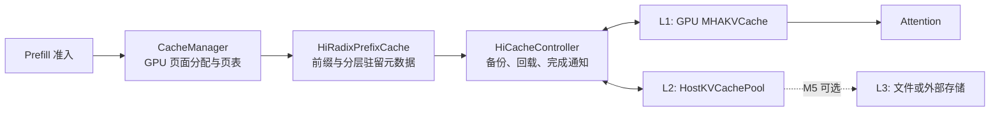

# Mini-SGLang HiCache 开发路线图

状态：开发规划，功能尚未实现。代码基线：`9a91cfa`，开发分支：`feat/hicache`，更新日期：2026-09-14。

目标是在现有 Radix Cache 上增加 CPU KV 缓存，使从 GPU 淘汰的共享前缀可以恢复使用，减少重复 Prefill。先完成单卡 GPU ↔ CPU 闭环，再支持异步传输和 Tensor Parallelism（TP），最后按需求扩展存储层。

SGLang HiCache 将 GPU、Host 内存和存储后端分别作为 L1、L2、L3，并通过扩展的 Radix Tree 记录前缀在各层的驻留位置。本文参考这一分层思想，下面的接口、默认策略和阶段划分是针对 mini-sglang 的实现建议。[SGLang HiCache 设计文档](https://docs.sglang.io/docs/advanced_features/hicache_design)

## 1. 首版范围与完成标志

首版 MVP 在 M2 完成：支持单卡、现有 `MHAKVCache` 使用的 MHA/GQA 布局，以及完整的 GPU → CPU 备份、GPU 淘汰、CPU → GPU 恢复流程。采用同步整页传输，先在关闭 Overlap Scheduling 和 CUDA Graph 的配置下验证正确性。

最小演示流程：

1. 请求 A 计算一个长前缀，并把已经计算完成的完整 KV 页备份到 CPU。
2. 执行若干不同前缀的请求 B、C，使 A 的 GPU 前缀页实际被淘汰。
3. 再次提交 A，确认发生 CPU 命中和 KV 回载，Prefill 只计算未复用部分。
4. 对比重算路径的 KV、logits 和贪心输出，并确认请求结束后页面与引用计数守恒。

HiCache 扩大的是可复用前缀的缓存容量。首版中，活动请求的上下文仍需放入 GPU；现有 `Engine.max_seq_len` 和 GPU 容量约束继续生效。活动 Decode 请求换出、逐层超长上下文执行、MLA、新 KV dtype、跨实例共享和自定义传输 kernel 放在后续独立工作中。

## 2. 当前代码与接入位置

| 位置 | 当前行为 | HiCache 所需改动 |
| --- | --- | --- |
| [`kvcache/base.py`](../python/minisgl/kvcache/base.py) | `MatchResult` 只有 `cuda_handle`，带有 HiCache TODO；`SizeInfo` 只有一层计数 | 增加可选 Host 匹配信息，保留 GPU 容量语义，定义传输期间的 handle 生命周期 |
| [`kvcache/radix_cache.py`](../python/minisgl/kvcache/radix_cache.py) | 节点只有 GPU 索引和单一 `ref_count`；`evict()` 删除整棵逻辑树的叶节点 | 引入分层驻留、保护计数、分层淘汰与保留 Host 节点的策略 |
| [`kvcache/mha_pool.py`](../python/minisgl/kvcache/mha_pool.py) | GPU 张量布局为 `[2, layers, pages, page_size, local_kv_heads, head_dim]` | 暴露受控的页读写接口，支持按页搬运完整 K/V 和所有层 |
| [`kvcache/__init__.py`](../python/minisgl/kvcache/__init__.py) | 工厂只接收 `device`，注册 `naive`、`radix` | 注册 `hicache`，通过显式初始化参数传入 KV pool 和 HiCache 配置 |
| [`scheduler/cache.py`](../python/minisgl/scheduler/cache.py) | 管理 GPU free list、页表、请求缓存提交和即时淘汰 | 增加回载页面预留、GPU/Host 容量分离、传输完成后的回收 |
| [`scheduler/prefill.py`](../python/minisgl/scheduler/prefill.py) | `_try_allocate_one()` 只使用 GPU handle，带有 Host match TODO | 接入 Host 匹配、回载等待和重新检查准入条件 |
| [`scheduler/scheduler.py`](../python/minisgl/scheduler/scheduler.py) | 调度 stream 与 Engine stream 分离；管理请求完成、取消和 idle | 驱动传输完成队列，处理跨 stream 依赖和生命周期收尾 |
| [`engine/engine.py`](../python/minisgl/engine/engine.py) | 创建 GPU pool，并额外分配一个 dummy page；初始化时可能调整 page size | 传递最终生效的布局与容量；dummy page 不参与 Host 缓存或分配 |
| [`scheduler/config.py`](../python/minisgl/scheduler/config.py)、[`server/args.py`](../python/minisgl/server/args.py) | `cache_type` 默认 `radix`；正式 CLI 参数为 `--cache-type` | 增加 HiCache 配置、解析与组合校验 |
| [`tests/core/test_cache_allocate.py`](../tests/core/test_cache_allocate.py) | 已覆盖部分 CPU 侧页对齐和分配场景 | 扩展为前缀匹配、分层淘汰、回载和资源守恒测试 |

两个需要先澄清的接口细节：`BasePrefixCache.match_prefix()` 声明不修改缓存，但现有 Radix 实现会在匹配时分裂节点并更新访问时间；`RadixPrefixCache.check_integrity()` 目前为空实现，`reset()` 尚未实现。M0 应明确允许的元数据变更，并建立可检查的不变量。

## 3. 建议架构与正确性约束



模块职责：

- `HiRadixPrefixCache`：前缀匹配、树分裂、GPU/Host 驻留状态、锁和淘汰候选选择。
- `HostKVCachePool`：固定容量的 pinned CPU 内存、Host 页分配与回收。
- `HiCacheController`：执行传输，持有任务期间的资源引用，产生完成通知；GPU 页面仍由 `CacheManager` 统一分配和回收。
- `PrefillManager`：根据已经就绪的 GPU 前缀和回载状态决定请求何时运行。

先在独立的 `hiradix_cache.py` 中实现分层逻辑，保持 `radix` 作为回归基线；验证两条路径后再提取稳定的树操作公共代码。

### 3.1 页与容量

- 搬运和缓存完整页。继续保留 `match_req()` 排除输入最后一个 token 的行为，保证至少有一个 token 进入 Prefill；未满页的尾部由请求原有生命周期管理。
- 区分页号、页首 token slot 和逐 token 索引。现有 `free_slots` 存的是页首 token slot，页表存的是逐 token 位置，不能混用。
- 每个 rank 的每页大小为 `2 × num_layers × page_size × local_kv_heads × head_dim × dtype_bytes`；`local_kv_heads` 遵循当前 `div_even(..., allow_replicate=True)` 的分片或复制规则。
- Host 初版采用与 GPU 对应的布局，容量向下取整为完整页，排除 dummy page。初始化应使用 Engine 调整后的 page size。
- `available_size` 和现有 `SizeInfo` 继续表示 GPU 容量。Host 空间独立统计，不能直接增加调度器可执行的 token 数。

### 3.2 匹配、树分裂与淘汰

- 匹配结果区分 GPU 已驻留前缀、Host 可恢复的连续总前缀和实际回载后缀。Host 命中长度只能在回载就绪后计入 `Req.cached_len`。
- 节点允许同时拥有 GPU 和 Host 副本；对没有驻留数据的层使用明确的空状态，禁止留下可被误用的旧索引。
- MVP 的 Host 备份采用连续前缀策略：先补齐祖先，再备份后续节点；容量不足时按 Host 叶节点淘汰或跳过本次备份。匹配遇到数据缺口必须停止。
- GPU 淘汰选择没有 GPU 驻留后代的未保护节点；Host 淘汰独立选择没有 Host 驻留后代的未保护节点。不能只复用现有逻辑树的 `is_leaf()`，否则 Host-only 子节点会阻止 GPU 父节点回收。
- GPU 淘汰后若仍有有效 Host 副本，则保留逻辑节点；删除元数据时必须保证不会切断仍可恢复的后代前缀。
- 树分裂同步切分两层索引、计数和有效状态。异步阶段的任务要记录稳定的页范围及版本，完成时不能仅依赖一个可能已分裂的节点对象。

### 3.3 传输与调度

| 状态 | 可供 Attention 使用 | 回收规则 |
| --- | --- | --- |
| GPU 有效、Host 无副本 | GPU 前缀已锁定后可用 | 按 GPU 引用计数决定是否可淘汰 |
| D2H 备份中 | GPU 数据仍有效 | GPU 源页与 Host 目标页都受保护；完成后才发布 Host 副本 |
| GPU 与 Host 都有效 | GPU 前缀已锁定后可用 | 两层分别计数与淘汰 |
| 仅 Host 有效 | 需要先回载 | 申请 GPU 页，并保护 Host 源页 |
| H2D 回载中 | 目标 GPU 页暂不可用 | 两端页面保持有效；完成并建立 stream 依赖后才发布 GPU handle |

准入时先保护已经命中的 GPU/Host 前缀，再计算并预留“回载页 + 未缓存输入与输出所需页 + 其他在途请求预留”。Host 命中减少重算量，但回载仍占用 GPU 页面；不能只按剩余 Prefill 长度估算显存。计算预算只扣实际执行的 Prefill token。

异步版中，`evict()` 只能返回现在即可重用的页面。在途备份不能伪装成已经释放的容量。取消请求只取消消费者，已经提交的拷贝需要等完成后再释放相关页面；可恢复的缓存 miss 或资源不足走等待/重算策略，CUDA 上下文等致命错误沿现有失败路径退出。

资源守恒按物理页面的唯一所有权检查：空闲页与所有已占用页构成容量的无重复划分，请求/树/传输可以引用同一页但不得重复记账。检查范围包括尚未插入树的活动请求页、未满页尾部和传输预留页；idle 检查也必须考虑尚未结束的传输。

## 4. 分阶段开发与验收

依赖顺序：**M0 → M1 → M2（MVP）→ M3 → M4 → M5（可选）**。每阶段以验收条件完成为准。

### M0：固化基线和接口语义

- [ ] 为现有 Radix 增加匹配、分裂、重复插入、锁定/解锁和页对齐测试，覆盖空命中及不足一页的输入。
- [ ] 明确 `match_prefix()` 的元数据变更边界，以及 `InsertResult.cached_len` 表示可释放重复 GPU 页的原有语义；Host-only 命中不能被误判成可释放的新 GPU 副本。
- [ ] 实现 Radix 的基本完整性检查，并定义只能在资源安全状态下调用的 reset 行为。
- [ ] 为 `MatchResult` 增加默认为空的 Host 扩展信息，保持 `MatchResult(cuda_handle)` 和 `naive`/`radix` 调用兼容。
- [ ] 准备固定 token ID 的 A → 干扰请求 → A 工作负载，并记录模型 revision、GPU/CPU、软件版本和实际页容量。
- [ ] 核对在线 TTFT 从发起请求计时到首个有效输出 token；当前 `benchmark_one()` 在 `await ...create()` 之后才记录首个时间点，复用前需校正这一口径。

**主要文件**：`kvcache/base.py`、`kvcache/radix_cache.py`、`tests/core/test_cache_allocate.py`；新增 `tests/core/test_radix_cache.py`、缓存基准脚本。

**验收**：现有分配测试与新增 Radix 测试通过；`naive`/`radix` 输出基线可复现；实验可证明 A 的 GPU 前缀被淘汰并发生重算。

### M1：Host 内存池与同步传输

- [ ] 新增 `kvcache/host_pool.py`，实现整页 pinned 内存池及分配、释放、容量查询。
- [ ] 新增 `kvcache/transfer.py`，实现同步 `backup`（GPU → CPU）和 `load`（CPU → GPU）原语。
- [ ] 为 `MHAKVCache` 提供页访问接口，先用 PyTorch 页切片/拷贝建立参考实现；离散页通过显式 gather/scatter 或逐页切片写回，验证写入的是原 pool。
- [ ] 支持非连续页号、不同源/目标页号及分批搬运；控制 staging buffer 大小，把它计入内存预算。
- [ ] 校验 Host 容量、整页取整和 pinned 内存分配失败，错误中给出实际申请大小。

**主要文件**：新增 `kvcache/host_pool.py`、`kvcache/transfer.py`、`tests/core/test_host_pool.py`、`tests/kernel/test_kv_transfer.py`；修改 `kvcache/mha_pool.py`。

**验收**：所有层的 K/V 经 GPU → CPU → 不同 GPU 页往返后逐元素一致；未涉及的页保持原值；页池耗尽、重复释放、边界页号得到明确处理。索引管理可做 CPU 测试，真实 pinned 内存传输需 CUDA 环境。

### M2：分层 Radix 与单卡同步 MVP

- [ ] 新增 `HiRadixPrefixCache`，实现双层匹配、分裂、锁、独立淘汰和完整性检查。
- [ ] 初版采用同步 `write_through`：在 `cache_req()` 提交已经计算完成的完整页后建立 Host 副本；只备份缺失部分，并处理祖先依赖和 Host 容量压力。
- [ ] GPU 淘汰保留可用 Host 前缀；CPU 命中时通过 `CacheManager` 分配 GPU 页、完成回载，再写入请求页表。
- [ ] 接入 `PrefillAdder`：保留 GPU handle 锁定后的二次容量检查，加入回载页预留与失败回滚。
- [ ] 处理重算请求与 Host 缓存的重复插入，保证只释放真正重复的 GPU 页，不能丢失刚计算出的唯一 GPU 副本。
- [ ] 接入配置和 cache 工厂；该阶段显式限制 TP=1，并校验暂未验收的执行组合。
- [ ] 提供 GPU 命中 token、实际 Host 回载 token、搬运字节数及两层页占用的基本计数。
- [ ] 验证请求正常结束、Chunked Prefill、取消和 Host 满池时的生命周期；资源不足时能够等待或按 GPU 前缀重算。

**主要文件**：新增 `kvcache/hiradix_cache.py`、`tests/core/test_hiradix_cache.py`、`tests/core/test_hicache_scheduler.py`；修改 cache 工厂、`scheduler/cache.py`、`scheduler/prefill.py`、配置和 CLI。

**验收**：第 1 节的 A → B/C → A 闭环自动通过；日志证明 A 发生 GPU 淘汰、Host 命中和回载；恢复的 KV 一致，logits 满足约定误差，固定贪心样例输出一致；全 miss、Host 不足和尾页场景不泄漏资源。

### M3：异步传输与调度重叠

- [ ] 新增 `kvcache/controller.py`，把 M1 传输原语包装成有界任务队列；每个任务携带方向、两端页范围、完成 event 和资源引用。
- [ ] 明确 D2H 对 Engine 写入完成的依赖，以及 H2D 完成后调度 stream/Engine stream 的等待关系；保持 GPU pool 地址稳定。
- [ ] 调度循环轮询完成队列，只有就绪数据才能进入 Prefill；先支持请求间的计算/搬运重叠。
- [ ] 将 Prefill 准入结果区分为“就绪、等待 I/O、容量不足”，改造遇到失败便 `break` 的逻辑，允许跳过等待 I/O 的请求，同时提供等待上限或老化机制。
- [ ] 去重同一前缀的并发回载；一个消费者取消后，其他消费者仍能完成。
- [ ] 备份队列满时延后或跳过备份；回载队列满时保留有界等待，按需要退回 GPU 前缀重算；避免持有资源互相等待而无法前进。
- [ ] 把在途任务纳入 scheduler 的 blocking/idle 判断；覆盖在线等待新请求、离线 `LLM.generate()` 返回及 shutdown 的 drain/清理。
- [ ] 覆盖异步期间树分裂、请求取消、页复用和重算竞争；传输 event 就绪前不得回收任一端。
- [ ] 分别启用 Overlap Scheduling、CUDA Graph，再验证二者同时开启；缓存管理与 Host I/O 位于 graph capture 外。

**主要文件**：新增 `kvcache/controller.py`、`tests/core/test_hicache_async.py`；修改 `scheduler/scheduler.py`、`scheduler/prefill.py`、`scheduler/utils.py`，必要时调整 `scheduler/io.py` 和 `llm/llm.py`。

**验收**：故意延迟拷贝时，已就绪的其他请求仍可前进；随机取消、分裂与小容量高频淘汰不出现旧 KV、重复释放或挂起；停止流量后传输能排空，offline 多次 generate 和 shutdown 正常完成。

逐层 H2D/Attention 重叠和自定义 CUDA kernel 是此阶段完成后的优化候选，只有 profile 证明搬运成为瓶颈时再引入。

### M4：TP 一致性、观测和性能验收

- [ ] 每个 TP rank 分配自己的 Host pool，保存本 rank 的 KV heads；启动日志报告每 rank 和整机 Host 内存总量。
- [ ] 协调匹配长度、备份/回载入队、资源预留结果和完成状态，使所有 rank 使用一致的逻辑前缀与批次；各 rank 的物理页号可以不同。
- [ ] 在固定调度点执行控制面同步，保证 collective 次序一致；不能根据单 rank 队列是否为空决定是否调用 collective。
- [ ] 对某 rank Host 不足、拷贝滞后、请求取消进行故障注入；所有 rank 一致等待、回退或失败退出。
- [ ] 验证 TP=2，并在硬件允许时扩展至 TP=4；覆盖 KV heads 被分片及 `allow_replicate=True` 的复制情况。
- [ ] 增加分层命中、实际回载、传输延迟、队列长度、淘汰次数和页占用统计，保持日志可解释。
- [ ] 跑第 6 节基准并导出配置与原始结果；根据结果决定是否增加 selective write-through、write-back 或更高效的数据布局。
- [ ] 将已验收的开关、支持矩阵、示例和局限写入 `docs/features.md`，移除相应的阶段性限制。

**验收**：支持的 TP 组合在压力测试中无分歧、挂起和资源泄漏；长前缀 Host 命中场景相对 `radix` 展示可复现的 TTFT 改善，同时报告吞吐与尾延迟代价。

### M5：可选 L3 存储

仅在有跨进程重启复用、容量继续扩展或跨实例共享需求时启动。上游也将共享范围交给存储后端及其部署配置；本地文件后端默认不构成集群共享。[SGLang HiCache 使用说明](https://docs.sglang.io/docs/advanced_features/hicache_best_practices)

- [ ] 定义批量 `exists/get/put` 存储接口，先实现带容量上限的本地文件后端，再评估 Mooncake 等外部后端。
- [ ] 使用前缀链式内容键；命名空间至少包含模型权重 revision、影响 KV 的模型/RoPE 配置、dtype、布局版本、page size、TP size/rank。首版只复用兼容布局。
- [ ] 增加原子写入、有效性校验、配额/淘汰和版本隔离；重启后通过内容键发现缓存，不能依赖已丢失的内存树元数据。
- [ ] 实现 L3 → Host → GPU 的有界预取；短读、损坏、超时或 miss 回退到可用的连续前缀，并沿用 TP 一致性协议。
- [ ] 实现 Host → L3 后台写入，明确正在写入/读取的数据与 Host 页回收之间的保护关系。

**验收**：进程重启后可复用同配置下的持久化 KV；不兼容配置不会误命中；文件缺失、损坏和超时不会产生错误输出或无限等待。

## 5. 建议配置接口

以下是待实现的 mini-sglang 参数设计，当前 checkout 尚不能执行 HiCache 启动命令；参数以本仓库正式名称为准。

| 参数 | 建议语义 | 首次阶段 |
| --- | --- | --- |
| `--cache-type hicache` | 使用 HiCache；默认值继续为 `radix` | M2 |
| `--hicache-host-size-gb` | 每 rank 的 Host KV pool 容量，明确单位为 GiB；启用 HiCache 时要求显式指定正值，向下取整到页 | M2 |
| `--hicache-write-policy write_through` | 首版仅支持备份已完成的完整页；其他策略经性能验证后增加 | M2 |
| `--hicache-transfer-mode sync\|async` | MVP 默认 `sync`，异步路径在 M3 验收后可选 | M2/M3 |
| `--hicache-max-inflight-pages` | 限制在途传输页数，并另行限制临时缓冲区字节数 | M3 |
| `--hicache-storage-backend` | 默认关闭，先支持 `file` | M5 |

单卡同步 MVP 的建议启动示例，仅在 M2 参数落地后使用；Host 预算需按实际机器配置调整：

```bash
MINISGL_DISABLE_OVERLAP_SCHEDULING=1 python -m minisgl \
  --model Qwen/Qwen3-0.6B \
  --tp-size 1 \
  --cache-type hicache \
  --hicache-host-size-gb 4 \
  --hicache-write-policy write_through \
  --hicache-transfer-mode sync \
  --attn fi \
  --page-size 16 \
  --cuda-graph-max-bs 0
```

Host 初始化需计入整机其他 rank、模型加载、tokenizer 和 staging buffer 的内存开销。关闭 HiCache 时不创建 Host pool、传输 stream 或后台任务。

## 6. 测试与基准矩阵

### 6.1 正确性

| 层级 | 重点场景 | 通过条件 |
| --- | --- | --- |
| CPU 元数据 | page size 1/4/16/64；空命中；非整页输入；分裂；重复插入；两层满池；锁与淘汰 | 可恢复前缀连续，页无重复分配，计数守恒 |
| CUDA 传输 | fp16/bf16；所有层 K/V；离散源/目标页；延迟 event；保护中淘汰 | 往返 KV 逐元素一致，未涉及页面不变，在途页面不提前重用 |
| 单卡集成 | 冷启动、GPU 命中、Host 命中、两层 miss、并发共享、Chunked Prefill、取消 | 与重算参考一致，资源最终释放，请求可前进 |
| 执行组合 | Overlap 关/开 × CUDA Graph 关/开；各已支持 attention backend 的合法 page size | M3 起通过相应组合；先用 `fi` 固定基线，避免自动选择掩盖差异 |
| 分布式 | TP=2/4；rank 延迟、容量不足、取消 | 各 rank 的逻辑前缀和调度决策一致，无 collective 死锁 |

MVP 建议先用仓库已有示例模型 Qwen3-0.6B 验证，再用显存允许的更大模型测性能。固定模型、dtype、attention backend、输入 token ID 和生成设置。KV 拷贝要求完全一致；不同 Prefill 形状可能引入浮点差异，因此同时记录 logits 误差与固定贪心样例输出，不能只依赖随机采样文本判断。

现有 `tests/core/test_scheduler.py` 是带主程序入口的手动运行脚本，执行 pytest 并不等于覆盖了真实调度过程。新增 HiCache 集成测试需要自动断言、超时与清理，并区分 CPU 测试、CUDA 测试和需要本地模型权重的测试。

### 6.2 性能工作负载

| 场景 | 构造方式 | 需要回答的问题 |
| --- | --- | --- |
| GPU 热命中 | 重复相同前缀，工作集小于 GPU cache | HiCache 元数据是否拖慢已有快路径？ |
| Host 命中 | 唯一前缀工作集大于可用 GPU cache、小于 Host cache；每个请求及输出单独能放入 GPU | 回载是否优于重新 Prefill？ |
| 两层容量不足 | 工作集大于 GPU + Host 的有效容量 | 淘汰、备份和重算是否仍能稳定前进？ |
| 无复用 | 前缀在开头即不同，后续请求不重复 | 额外拷贝和元数据开销有多大？ |
| 混合流量 | 长短请求混合，部分共享前缀，同时有 Decode 和取消 | TTFT 尾延迟和 Decode 间隔是否受到回载影响？ |

建议新增 `benchmark/offline/bench_hicache.py`，使用固定 token ID 检查准确命中和淘汰；新增 `benchmark/online/bench_hicache.py` 测量用户可见延迟。在线 chat template 和 tokenizer 会影响真实共享前缀，必须记录实际 token 前缀，不能只比较原始字符串。

每次对比 `radix`、同步 HiCache、异步 HiCache，固定 GPU `--num-pages`、page size、并发、输入/输出长度、模型和采样参数。分开记录冷启动与暖缓存，每组至少重复 5 次；在计时外完成模型/JIT 预热，并验证每次测量开始时的两层驻留状态。CPU 命中实验必须先证明目标 GPU 前缀已被淘汰。

至少导出以下指标及原始请求结果：

- TTFT（首 token 延迟）的 P50/P95/P99、端到端请求延迟、Decode token 间隔、输出 token/s 和请求/s。
- GPU 命中 token、Host 实际回载 token、实际 Prefill token；GPU 命中与 Host 回载分段统计，避免重复计入命中率。
- H2D/D2H 字节数、带宽、拷贝和排队延迟、在途任务峰值、GPU/Host 已用页与淘汰量。
- 模型 revision、软件版本、完整启动参数和硬件信息，包括 PCIe/NUMA 情况。

性能验收先确认正确性和资源稳定性。在长前缀 Host 命中场景中展示低于 `radix` 的 P50 TTFT，同时披露尾延迟；无复用场景以吞吐退化不超过 5% 为建议目标，M0 测量环境噪声后固定门槛。以上是开发目标，并非已测得的收益；若搬运慢于重算，再依据结果加入最小回载长度或选择性备份策略。

## 7. 第一批提交顺序

1. `test(kvcache): cover radix prefix and page ownership invariants`：完成 M0 的关键测试和契约澄清。
2. `feat(kvcache): add host page pool and synchronous transfers`：独立完成 M1，保留可验证的参考拷贝路径。
3. `feat(kvcache): add hierarchical radix metadata and eviction`：完成 M2 的树、锁、计数与淘汰逻辑。
4. `feat(scheduler): restore host prefixes before prefill`：接通 M2 的准入、配置和 A → B/C → A 自动验收。
5. `feat(hicache): overlap transfers with request scheduling`：完成 M3 的事件依赖、队列和生命周期测试。
6. `feat(hicache): coordinate tensor parallel cache operations`：完成 M4 的 TP 一致性。
7. `bench(hicache): add reproducible capacity-pressure workloads`：完善 M0 起建立的基准，记录 M4 结果和使用说明。

下一步从 **M0 的 Radix 不变量测试和 Host 匹配接口** 开始，随后实现可以独立验证的 Host pool 与同步往返拷贝。
